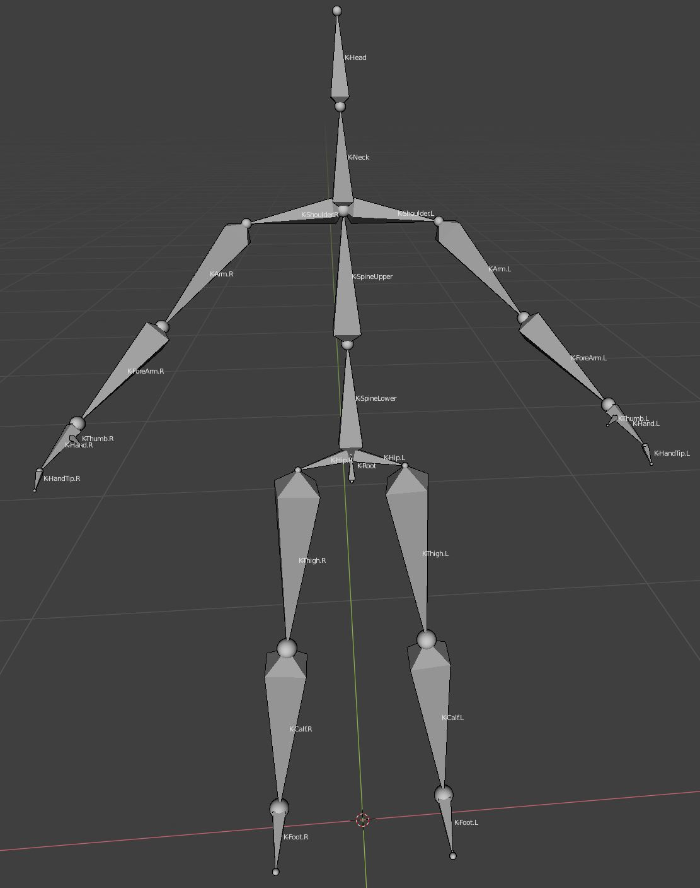

# KinectToJSON



C++ wrapper DLL of Joints for Motion Capture of multiple bodies using a Kinect v2 sensor.  As the name of the repo suggests, output is formatted in JSON.  All locations returned in meters, & rotations in radians.

```javascript
{
"floorClipPlane": {"x":-0.011,"y":0.999,"z":0.033,"w":0.740}, "cameraHeight": 0.740,
"frame": 0,
"bodies": [
    {
        "id": 72057594037933501,
        "bones": {
                "SpineBase": {
                        "state": "Tracked",
                        "location": {"x":0.0,"y":0.0,"z":0.0},
                        "rotation": {"x":0.0,"y":0.0,"z":0.0,"w":0.0}
                },
                "SpineMid": {
                        "state": "Tracked",
                        "location": {"x":0.0,"y":0.0,"z":0.0},
                        "rotation": {"x":0.0,"y":0.0,"z":0.0,"w":0.0}
                },
                "Neck": {
                        "state": "Tracked",
                        "location": {"x":0.0,"y":0.0,"z":0.0},
                        "rotation": {"x":0.0,"y":0.0,"z":0.0,"w":0.0}
                },
                // ... 21 joints not shown, for a total of 25
                "ThumbRight": {
                        "state": "Inferred",
                        "location": {"x":0.0,"y":0.0,"z":0.0},
                        "rotation": {"x":0.0,"y":0.0,"z":0.0,"w":0.0}
                }
        },
        "hands": {
                "left": "Open",
                "right": "Closed"
        }
    }
    // ... up to 6 bodies total
]
}
```

## Requirements ##

A Kinect v2 sensor, connected to a Windows 8 or greater PC, using the Kinect Adapter, into a USB 3 port is required.  There are no drivers which come automatically, as far as I know.  You might connect it, and try a 'Check for Updates' from Windows setup / update, but not hopeful.

There is a [Kinect SDK](https://www.microsoft.com/en-us/download/details.aspx?id=44561) which could be installed, but it is only required when compiling from source.  There are a few interesting sample applications in the SDK though.  In the `kinectRuntime` directory of the repo, are the re-distributable driver installs from the SDK.  See that directory's readme for more.

## Pre-compiled Media ##

The `dist` directory has both a 32 bit (x86) and 64 bit DLL.  These are for loading into an existing application, e.g. Blender.  There is also a command line x86 .exe.  This only displays output to the console, and was primarily used as an aid to development.  It might be adaptable to become a web server, although there are no plans to do so.  It was included only to be able to test things are setup & working on a machine, independent of any integration.

Note: For the [MakeHuman Community Blender add-on](https://github.com/makehumancommunity/community-plugins),  the 2 DLL's are already inside, so you only need to additionally install the Kinect drivers.

## Entry Points ##

There are 4 entry points which are exported in the DLL.  Most return a `HRESULT`, which is an integer where 0 indicates a successful result.

###openSensor, ordinal 4:##

```c
/**
 * Open the sensor using these simple char settings for easy mapping to Python ctypes.
 * @param {char / ctypes.c_char} actionPoseStart - anything other than \0, is true.  Too many issues passing a bool from Python
 * @param {char / ctypes.c_char} Forward_or_Mirror - F for matching with the actual side, or M for as looks in a mirror
 */
DllExport HRESULT openSensor(char actionPoseStart, char Forward_or_Mirror)
```

This must be the first call. It is broken out from beginning an actual body tracking session, because there are many more things a sensor can do.  Any addition of other capabilities would all begin with an opening of the sensor.  Arguments which might seem could be specified when beginning body tracking are done here instead, since they may also be relevant for other features.

####actionPoseStart-####

This is a switch for when to start returning data, after calling beginBodyTracking.  When 'true', no data will be returned until a body raises their hands above their shoulders, or T pose.  This is very useful when the operator of the program & the one being scanned is the same person.  If the application is recording root bone translation relative to the first frame, you do not want the frame of them running out into the sensor's field being the first frame.  When there are multiple bodies, only one body needs to signal to start, once everyone is in place.

A beep will also give audio feedback that recording has begun.  Actually, any frame where the number of bodies is different from the previous frame causes a beep.  For the first frame, the previous frame was 0.  This can be very useful for mapping out the field where scanning takes place.  Note: the console .exe does not beep, since this is a windows MessageBeep() call.

####Forward_or_Mirror-####
The data returned by the sensor is always as if looking into a mirror.  For data capture this is not desired.  When 'F', data returns suitable for data capture.  Note: rotation data is un-changed at this time.

###beginBodyTracking, ordinal 1:###

```c
/**
 * Begin tracking up to 6 bodies.
 * @param cb - The callback function which is passed the JSON as an argument.
 */
DllExport HRESULT beginBodyTracking( void (*cb)(char *) )
```

Returns scans of joints to the callback supplied.  The first frame returned will be numbered 0.  A Kinect v2 scans @ 30 fps, so time relative to the first frame can be calculated.  If a body is not present for a given scan, it will not be included.  If no bodies are found in a scan, then no data will be returned, but the frame number will be incremented.

###endBodyTracking, ordinal 3:###

```c
/**
 * stop body, if it had been started.
 */
DllExport void endBodyTracking()
```

There is really no reason to call `endBodyTracking` unless there is more than one type of kinect scanning supported.  `closeSensor` will call this for you.

###closeSensor, ordinal 2:###

```c
/**
 * Close the sensor & stop any tracking that may be occurring.
 * @returns the camera height, in millis so it can be an int.
 */
DllExport HRESULT closeSensor()
```

The camera height is returned here, because Blender requires that UI fields can only be updated inside a 'click' event.  This information is also in the JSON.  This is important for when the sensor is tilted up too much, then value will be 0.  In addition to being reported / returned, the height (floor clip plane) is used to adjust the data (inside the DLL), so that it is as if the sensor is on the ground, when it might not be.


