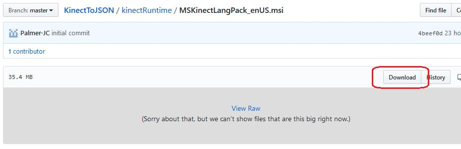

# Kinect v2 Drivers

Kinect v2 is no longer being sold.  These are the last version of driver installs available out of the Kinect v2 SDK.  It is likely only one or the other needs to be used.  The Microsoft software install, .msi, format is smaller by a considerable amount (35.4 mb vs 89 mb ), so the .exe might be doing more.

Regardless of which, click on the link for the file above.  You will then navigate to a page like that below.  Click on the 'Download' button.

After this point, the exact response will vary by browser.  Once the file is local to your machine, open it.  Both will show 'Microsoft Corporation' as the verified publisher, though the .exe version has extra little form that you need to click 'Install' to see.  This is shown in a modal full screen form, which you cannot take a screen print of.

While it should obvious, these files are copyright, Microsoft Corporation.  The Apache 2.0 license of this repository does not apply to them.